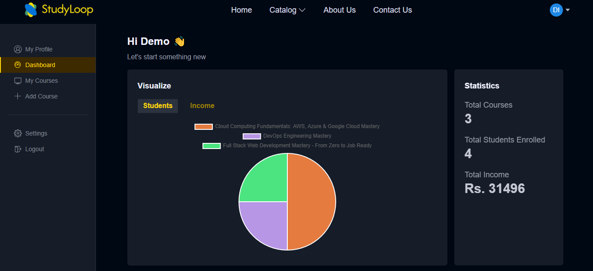
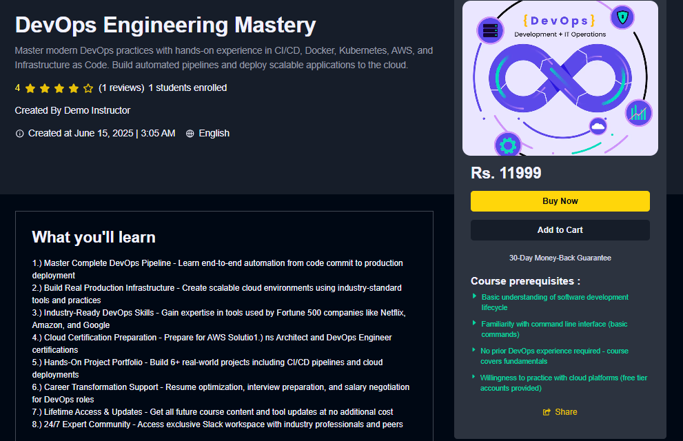
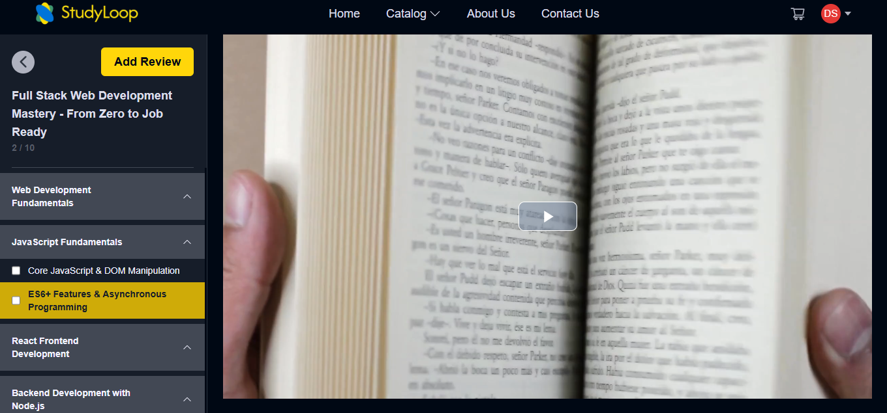

<h1 align="center">🚀 StudyLoop - An Online Education Platform</h1>

<p align="center">
  
</p>


<p align="center">
  <b>Empowering learning, teaching, and growth with a modern, full-stack education platform.</b>
</p>

---

### Live Website: ⚡ <a href="https://study-loop-gray.vercel.app/" target="_blank"><strong>StudyLoop »</strong></a> 

### Explore the Documentation: 📝 <a href="https://drive.google.com/file/d/1ogaFeooltW30m4K8b0IlD5gy2xuRrVDn/view?usp=sharing" target="_blank"><strong>Explore the Docs »</strong></a>

---

### 👤 Demo Credentials

| 👤 **Role**     | 📧 **Email**                 | 🔒 **Password**    |
|----------------|------------------------------|--------------------|
| 👨‍🏫 Instructor | `demo@instructor.dev` | `Pass@123`   |
| 👨‍🎓 Student    | `demo@student.dev`    | `Pass@123`      |


### 💡 Note:-
> **Demo accounts have read‑only access.**  
> Instructors can’t create/edit/delete courses or change their profile, and students can’t enroll or purchase.

---

## ✨ Features

- 🔒 **Secure Authentication** (JWT, Email Verification)
- 👨‍🏫 **Role-Based Dashboards** for Students & Instructors
- 🎬 **Course Builder** with Video Upload & Streaming
- 💳 **Payment Integration** (Razorpay)
- ⭐ **Ratings & Reviews**
- 📊 **Progress Tracking & Analytics**
- 📱 **Responsive Design**
- 🛠️ **Admin Panel** (optional)

---

## 🖥️ Tech Stack

<p align="center">
  
  
  
  
  
  
  
  
</p>

---

### 📊 Instructor Dashboard


---

### 📚 Course Page


---

### 🎬 Video Player



---

## 🚦 Getting Started

1. Clone the Repository
   ```sh
   git clone https://github.com/shishir16092002/StudyLoop-EdTech-Platform.git
   cd StudyLoop-EdTech-Platform

   ```
2. Go to the
   ```sh
   cd server
   ```
3. Make .env File and give key and values as .env.sample File defined
4. Install NPM packages in server file
   ```sh
   npm install
   ```
5. Go to the root file
   ```sh
   cd ..
   ```
6. Make .env File and give key and values as .env.sample File defined
7. Install NPM packages in root file
   ```sh
   npm install
   ```
8. Run the Project from root file
   ```sh
   npm run dev
   ```

   
---

## 🌐 Deployment

- **Frontend:** [Vercel](https://vercel.com/) / [Netlify](https://netlify.com/)
- **Backend:** [Render](https://render.com/) / [Heroku](https://heroku.com/)
- **Database:** [MongoDB Atlas](https://www.mongodb.com/cloud/atlas)

---

## 🤝 Contributing

Contributions, issues, and feature requests are welcome!  
Feel free to check the [issues page](https://github.com/shishir16092002/StudyLoop-EdTech-Platform/issues).

---

## 📄 License

This project is licensed under the [MIT License](LICENSE).

---

## 🙏 Acknowledgements

- [Cloudinary](https://cloudinary.com/)
- [Razorpay](https://razorpay.com/)
- [React Hot Toast](https://react-hot-toast.com/)
- [Video React](https://video-react.js.org/)

---

<p align="center">
  <b>Made with ❤️ by Shishir Yadav (https://github.com/shishir16092002)</b>
</p>